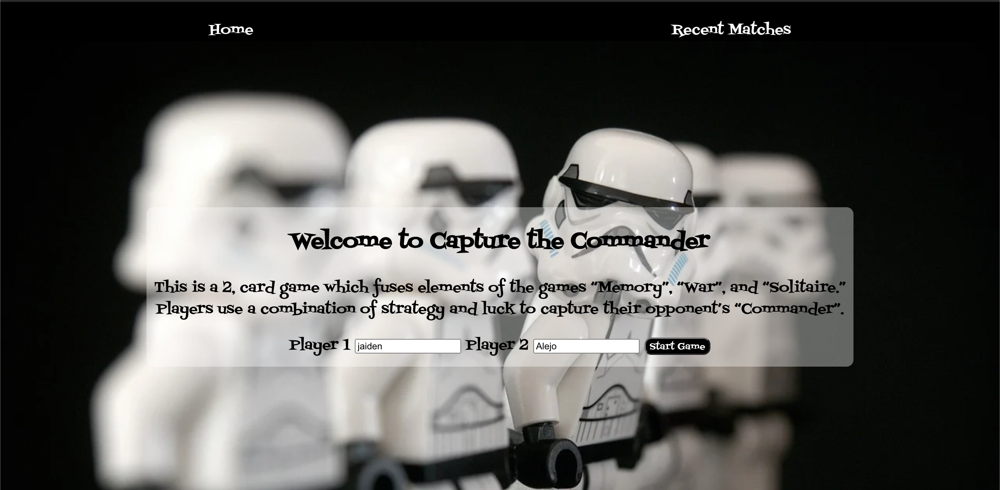
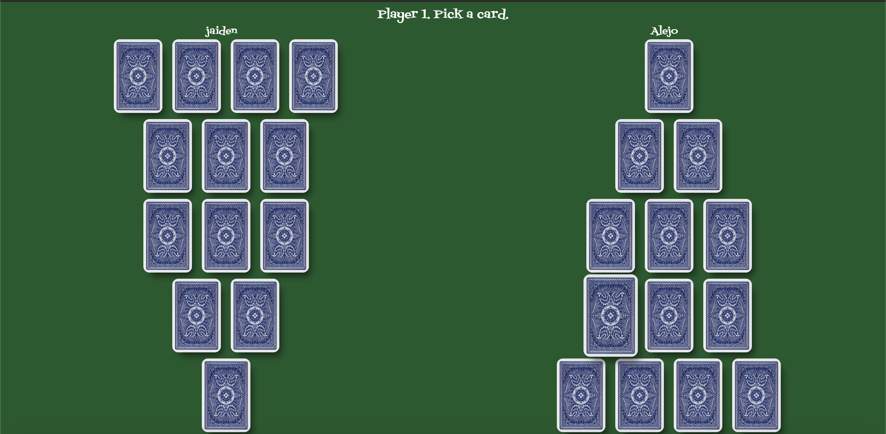
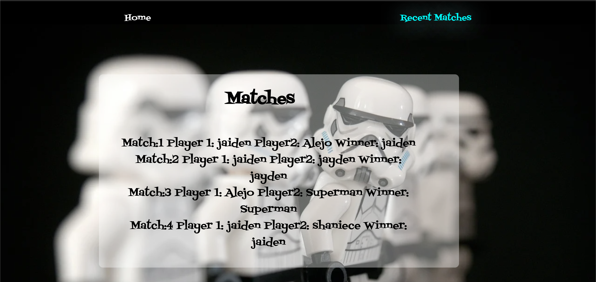

# [Capture The Commander](https://capture-the-commander.netlify.app/)

 ## **An online card game where luck and memory meets strategy.**

 - For detailed instruction for the game please visit this [Link.](https://www.pagat.com/invented/commander.html)

 # **Features**
 1. Players can have **Unique** names besides the default player1 and player 2. 
 

2. **Recent Match Results** are saved saved onto the database. 

3. **Upcoming Features** future planned updates include.
    - **User Auth** so players can create accounts. 
    
    - **WebSockets** intergration so players can play over the internet
    
    - **Customizable Decks** so players can change decks. 

# **Installation Instructions**

1. Fork and clone this repository

2. From the root folder `cd backend`
to get into the `backend` folder.

3. `npm i` to install and necessary packages.

4. From the backend folder `psql -f db/seed.sql` (This will create the local database)
    - You might want to check to make sure the database was correctly created.

5. After the database is installed you can `cd frontend` and run `npm i` or `npm install` to install all necessary packages.

6. Start coding!(To check the live test run `npm start` in the frontend folder). 

7. Run `npm run start:dev` to run the back end with `nodemon`   
    